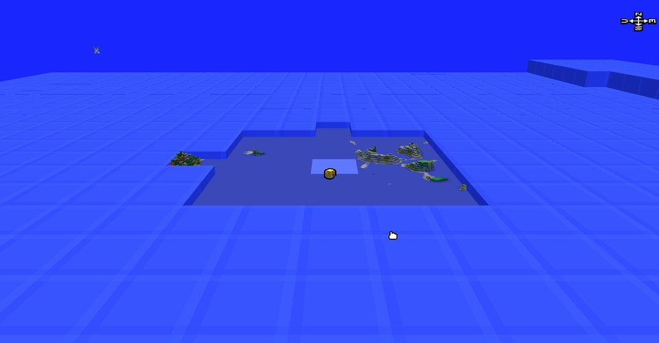
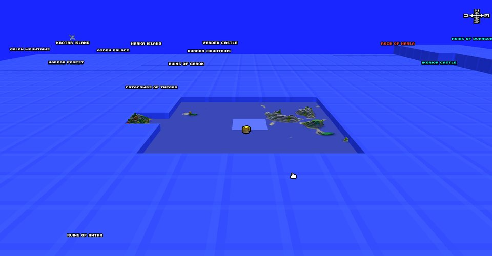
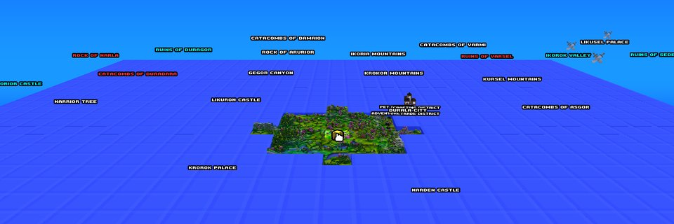

# Region Reveal

[](https://github.com/Jovinull/RegionReveal/releases/latest)


[](LICENSE)

When you walk into a named area in Cube World Alpha — "Lands of Durala",
"Aruka Ocean", the regions the world map outlines with dotted lines — every
label in that area appears on the world map: cities and their districts,
castles, palaces, catacombs, ruins, mountains, canyons, valleys, lakes, islands.

Only the labels. The ground stays exactly as you explored it, and the game's
save is never touched. The whole area's labels show at once, at any zoom, even
standing on its border.

| Same world, same spot, without the mod | With the mod |
|---|---|
|  |  |



**Install:** download `dinput8.dll` from the
[latest release](https://github.com/Jovinull/RegionReveal/releases/latest), put
it next to `Cube.exe`, play. Delete it to uninstall.

> **Checked in the running game.** A diagnostic build compared every label the
> map drew against the game's own data — in new worlds on both Alpha builds,
> standing on an area's border, after crossing into the next area with the map
> closed, and after a restart: every label of the areas entered shown, none of
> any other area. With the DLL removed the same spot shows no label at all, so
> nothing reaches the save. See [`docs/TESTING.md`](docs/TESTING.md).

## What it does

When the player enters an area for the first time, RegionReveal remembers it,
and from then on the map's label passes see every cell of that area as
revealed. The game then draws the labels it already has for those cells, the
same way it would after you had walked over every one of them.

Entered areas stay revealed across sessions, kept per world in
`RegionReveal_<world>.visited` beside the game. Areas you never entered, and
areas of other worlds, stay hidden. It works on a server too: each online world
gets its own history.

## What it does not do

- **It does not reveal terrain.** The map's ground comes from tiles the game
  generates near where you have been; the mod leaves those, and the blue squares
  around them, alone.
- **It does not invent anything.** A label appears only when the game has
  generated it. Right after a world loads, the points of interest close to the
  player (city districts, dungeon entrances) take a few seconds to be filled in.
- **It does not touch gameplay.** Quests, bosses, loot, fast travel and world
  generation are untouched. Only the two map passes that draw labels get a
  different answer, and only they are widened; every other caller of the same
  function, fast travel included, keeps seeing the real map.
- **It does not write to the save.** The reveal bit is set on a copy of the cell
  handed to the label pass, never on the cell itself.

## Labels at any zoom, across the whole area

The game itself limits its map labels in two ways, and by default the mod lifts
both:

- it draws points of interest — city districts, dungeon entrances — only when
  the map is zoomed in; with the mod they show at every zoom;
- it draws labels only within 32 cells of the map's centre, less than an area is
  wide; with the mod the range is 96, so even standing on one border of an area
  you see the labels up to the opposite one.

Both are a few bytes in the game's map-drawing code, checked byte for byte
before anything is written, and they only change which labels the game draws.
The range costs frame time while the map is open, and only then; the zoom change
costs nothing measurable. On the test machine, with any zoom on:

| Label range (cells each way) | 32, the game's | 64 | **96, the default** | 127, the most |
|---|---|---|---|---|
| Map screen | about 80 fps | about 66 fps | about 60 fps | about 49 fps |

Both can be changed in an optional `RegionReveal.ini` beside `Cube.exe`, read
when the game starts:

```ini
[labels]
any_zoom=1   ; 0: points of interest only when zoomed in, as in the game
range=96     ; cells each way from the map's centre: 32 (the game's) to 127
```

## Supported builds

Both Alpha builds are supported. Functions are located by byte signature at
startup, so no absolute address is hard-coded.

The 2013-07-20 build is the one the Alpha modding ecosystem targets — the Cube
World Mod Launcher v1.5 accepts only its exact file size and calls it **Alpha
0.1.1**. Details in [`docs/QUBE_COMPATIBILITY.md`](docs/QUBE_COMPATIBILITY.md).

| Build | `Cube.exe` SHA-256 | Size |
|---|---|---|
| 2013-07-20 (primary) | `84a7a132a84d4282338e7ea45a1940d32066d64e39cbafed8f2418d5a6dc30bf` | 3 885 568 |
| 2013-07-02 | `a4eeb3606ad2b82e4c9b3d0db6f9472ffa6e89a4d56084a9114ff1fb3c812699` | 3 878 400 |

Anything else is refused: if a signature is missing or matches twice, no hook
is installed, a line is written to `RegionReveal.log`, and the game runs
unmodified. Full audit in [`docs/TARGET_BUILD.md`](docs/TARGET_BUILD.md).

## Installing

Copy **`dinput8.dll`** into the Cube World Alpha folder, next to `Cube.exe`, and
start the game normally.

`Cube.exe` imports one function from `dinput8.dll`, and Windows searches the
executable's own folder before the system directory, so the mod loads before the
game's entry point and forwards that call to the real `dinput8.dll` in
`System32`. **One file is added; nothing is renamed, replaced or written to.**
Delete it and the install is stock again.

Expect the antivirus to object. The mod patches five bytes of `Cube.exe` in
memory, which is genuinely the same technique a malicious hook uses; see
[`docs/TOOLING.md`](docs/TOOLING.md) for what the DLL does and does not link
against.

`RegionReveal.log`, beside the game, records which build was detected and every
area you enter. Back up your `Save/` folder before playing with any mod, this
one included.

## Building

Requires Visual Studio 2022 Build Tools with the 32-bit MSVC toolset and a
Windows SDK. The game is PE32, so the mod must be 32-bit.

```sh
cmake -B build -A Win32
cmake --build build --config Release
build/Release/region_test.exe
python tests/run_tests.py build/Release/signature_test.exe "<game folder>/Cube.exe"
```

## How it works

One 5-byte detour, on `cube::WorldMap::getCell(x, y)`, installed from `DllMain`
before the game has started any thread.

- **Tracking.** Four times a second, on the game's main thread, the mod reads
  the local player's cell and asks `cube::World`'s own area lookup which area it
  belongs to. An area entered for the first time is recorded.
- **Revealing.** The map overlay draws labels in two passes, and each calls
  `getCell` from exactly one place. When one of those two calls asks for a cell
  of a recorded area, it gets a copy with the reveal bit set. The answer for
  each cell is cached, so the game's lookup runs once per cell, not per frame.
- **Widening the label passes.** Unless turned off, the zoom check that skips
  the point-of-interest pass is replaced with a no-op and the 32-cell radius of
  both passes becomes 96 — twelve bytes, identical in both builds.
- **Never guessing.** The game's lookup picks the nearest of the area centres it
  has generated so far, so far from where the player has been it can name the
  wrong area. The mod only trusts an answer once every centre the lookup
  compares exists; until then the cell stays hidden and is asked again a second
  later.

Details and evidence: [`docs/BEHAVIOUR.md`](docs/BEHAVIOUR.md),
[`docs/MAP_LABELS.md`](docs/MAP_LABELS.md) and
[`docs/REVERSE_ENGINEERING.md`](docs/REVERSE_ENGINEERING.md).

## Known limitations

- **Labels only fill in where the game has generated the world.** A visited area
  far from where you are now is restored when you get near it again, as the
  world generator reaches it.
- **A landmark on an area's border can show from either side.** The game keeps
  one landmark per 8 × 8 block of cells, and the label of a block cut by the
  border can show as soon as any of its cells is in an area you entered.
- **Busy labels when zoomed far out.** With every label of an area on screen,
  names close together — a city's districts — can overlap.
- **Bosses are the game's own business.** The Alpha's boss hunts are missions,
  drawn on the map as crossed swords by the game itself, with or without the
  mod — the screenshots above show the same icon in both. The mod reveals the
  places, not the missions.
- **No per-category toggles**, deliberately: the reveal unit is the area.

## Licence

MIT — see [`LICENSE`](LICENSE). No game asset or executable is redistributed
here, and no third-party mod code is included.
